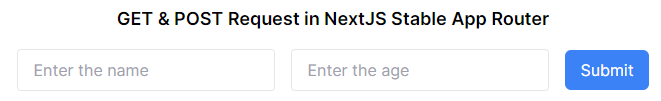

# HTTP GET & POST Request in NextJS Stable App Router
This is a [Next.js](https://nextjs.org/) project.



## Getting Started

1. First, clone the repository into your directory.
3. Then run
```bash
npm run dev
```

Open [http://localhost:3000](http://localhost:3000) with your browser to see the result.
